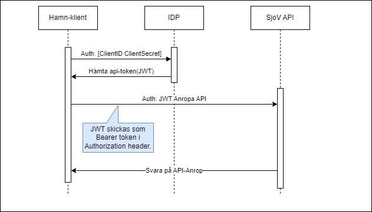

[English version](README_en.md)

# Bakgrund
AAA är ett uppdrag för att utveckla API:er för att dela ankomst- och avgångsinformation hämtat från fartygsrapporter inskickade till MSW samt information kring lotsningar från Sjöfartsverkets lotsplanering.

# Autentisering och auktorisation
För att kunna anropa Sjöfartsverkets API:er behöver klienterna ha en giltig `JWT-token`. `JWT` står för *"JSON Web Tokens"* och är en web-standard ([RFC 7519](https://tools.ietf.org/html/rfc7519)) för att säkert överföra data mellan två parter.

Klienten hämtar giltig `JWT-token` från Sjöfartsverkets `IDP` (Identity Provider) och autentiserar sig genom `Basic authentication scheme` med parametrarna `ClientID` som användarnamn och `ClientSecret` som lösenord. Dessa får klienten tag på genom att Sjöfartsverket lämnar ut dessa över en säker kanal (i dagsläget e-post + SMS). `ClientID` är en publik identifierare av klienten. `ClientSecret` är en hemlig och för klienten unik nyckel.

I processen för att hämta ut en valid `JWT-token` behöver klienten även skicka med en parameter `scopes` (*anspråk*) innehållandes en lista på resurser som klienten vill konsumera. Nedan listas de `scopes` som Sjöfartsverket kräver för de publika resurserna:

- `https://snt-public-api.tst.sjofartsverket.se/` - Grundåtkomst till API:erna, krävs för alla resurser.
- `https://snt-public-api.tst.sjofartsverket.se/pilotages ` - Krävs för åtkomst till lots-resurser (pilotage).
- `https://snt-public-api.tst.sjofartsverket.se/visits ` - Krävs för åtkomst till besöks-resurser (visit).
- `https://snt-public-api.tst.sjofartsverket.se/cancelledvisits ` - Krävs för åtkomst till resurser för inställda besök (cancelledvisit).

> Under punkt 1 nedan finns ett exempel på hur ett anrop för att hämta en token från Sjöfartsverkets `IDP` kan se ut.

## Flöde
Nedan visas en bild på hur flödet ser ut utifrån hamnarnas klient-perspektiv:

1. Klienten anropar Sjöfartsverkets `IDP` med en `HTTP POST` innehållandes `ClientID` och `ClientSecret` och får tillbaka en *tidbestämd* signerad `JWT-token`. Tidrymden är i dagsläget 5 minuter. Exempel på ett sådant anrop finns nedan:

  ```
   curl -X POST 'https://idp.tst.sjofartsverket.se/realms/z4_internal/protocol/openid-connect/token' --user $CLIENT_ID:$CLIENT_SECRET -d 'grant_type=client_credentials' -d scope='https://snt-public-api.tst.sjofartsverket.se/ https://snt-public-api.tst.sjofartsverket.se/pilotages https://snt-public-api.tst.sjofartsverket.se/visits'
  ```

> **Notera!** I exemplet ovan så är `CLIENT_ID` och `CLIENT_SECRET` förangivna miljövariabler.

2. Klienten kan sedan ropa på Sjöfartsverkets REST API:er för besök (`Visit`) och lotsning (`Pilotage`). För att bli autentiserad (och senare auktoriserad) behöver `JWT-token` finnas med i `HTTP-header` enligt `Bearer`-schemat/formatet.

    ```
    Authorization: Bearer <token>
    ```
3. Om klienten blir både autentiserad och auktoriserad så svarar API:et med `HTTP 200 OK` och en `body` innehållandes data. Blir svaret istället `HTTP 401 Unauthorized` har *autentiseringen* misslyckats, t.ex. om `JWT-token` inte är giltig. Blir svaret `HTTP 403 Forbidden` är inte klienten *auktoriserad* att hämta begärd information från API:erna.



### Mer teknisk info
https://jwt.io/introduction

# Länkar
## Testmiljö
* Token service: https://idp.tst.sjofartsverket.se/realms/z4_internal/protocol/openid-connect
* API Base URL: https://snt-public-api.tst.sjofartsverket.se/ 
* API-dokumentation: https://snt-public-api.tst.sjofartsverket.se/swagger/
* Scopes
  ```
  https://snt-public-api.tst.sjofartsverket.se/
  https://snt-public-api.tst.sjofartsverket.se/pilotages
  https://snt-public-api.tst.sjofartsverket.se/visits
  https://snt-public-api.tst.sjofartsverket.se/cancelledvisits
  ```
## Produktionsmiljö
* Token service: https://idp.sjofartsverket.se/realms/z4_internal/protocol/openid-connect 
* API Base URL: https://snt-public-api.sjofartsverket.se/
* Scopes
   ```
  https://snt-public-api.sjofartsverket.se/
  https://snt-public-api.sjofartsverket.se/pilotages
  https://snt-public-api.sjofartsverket.se/visits
  https://snt-public-api.sjofartsverket.se/cancelledvisits
  ```  
